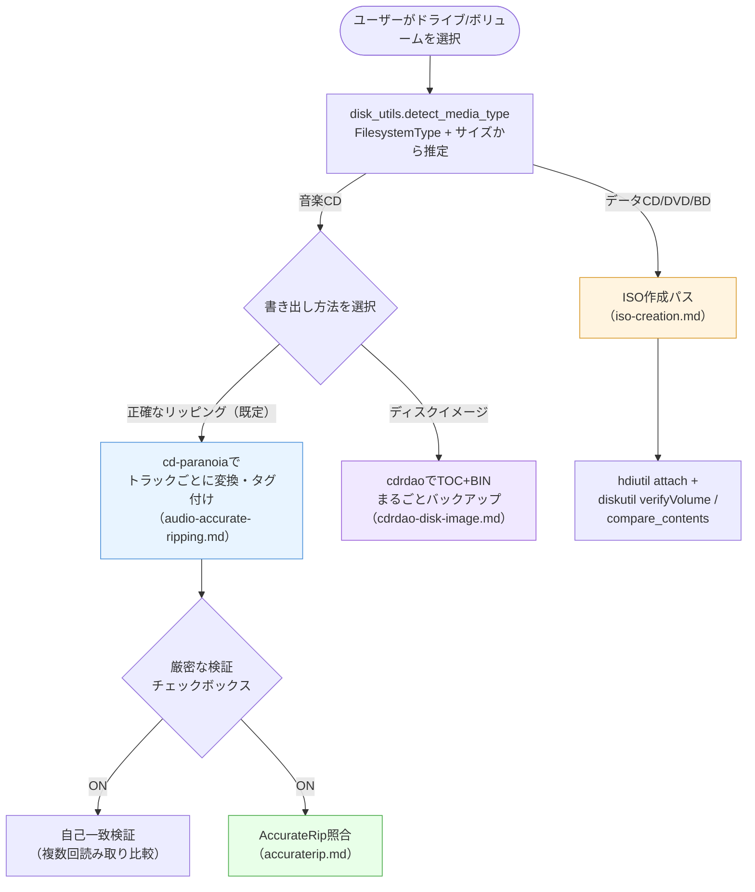
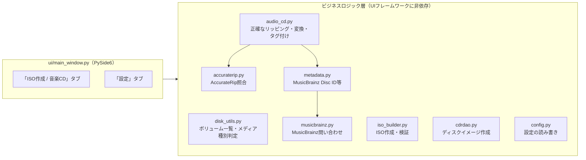

# mkhybrid-gui 設計ドキュメント（全体像）

このディレクトリは、[README.md](../../README.md)（利用者向けマニュアル）や
[AGENTS.md](../../AGENTS.md)（AIコーディングエージェント向けの作業方針・
回帰防止メモ）とは別に、**実装全体の設計判断とその根拠**をまとめたもの。
対象はデータCD/DVD/BD（ISOイメージ作成）と音楽CD（正確なリッピング・
ディスクイメージ・AccurateRip照合）の両方。実装が変わった場合は、
対応するドキュメントも同じ変更の中で更新すること。

## ドキュメント一覧

| ドキュメント | 対象メディア | 内容 |
| --- | --- | --- |
| [iso-creation.md](iso-creation.md) | データCD / DVD / Blu-ray | `hdiutil makehybrid`によるハイブリッドISO作成、検証方式（`hdiutil verify`を使わない理由） |
| [audio-accurate-ripping.md](audio-accurate-ripping.md) | 音楽CD | `cd-paranoia`による正確なリッピング、自己一致検証、メタデータ・MusicBrainz連携 |
| [cdrdao-disk-image.md](cdrdao-disk-image.md) | 音楽CD（追加オプション） | `cdrdao`によるTOC+BINディスクイメージバックアップ |
| [accuraterip.md](accuraterip.md) | 音楽CD | AccurateRipオンラインDBとのCRC照合 |

## 全体構成

## モジュール構成

| レイヤー | 責務 | 依存 |
| --- | --- | --- |
| `ui/main_window.py` | ウィジェット表示・ユーザー操作・ワーカースレッド起動 | ビジネスロジック層 |
| `disk_utils.py` | `diskutil`のパース、メディア種別判定、アンマウント/再マウント | なし（`config.py`のみ） |
| `iso_builder.py` | `hdiutil makehybrid`によるISO作成・検証 | なし |
| `audio_cd.py` | `cd-paranoia`による正確なリッピング、変換、タグ付け | `accuraterip.py`、`metadata.py` |
| `cdrdao.py` | `cdrdao`によるディスクイメージ作成 | `audio_cd.py`（PATH解決ロジックを再利用） |
| `accuraterip.py` | AccurateRip照合（ID計算・CRC・ネットワーク） | なし（純粋関数のみ） |
| `metadata.py` | `AlbumMetadata`/`TrackMetadata`、MusicBrainz Disc ID計算 | なし |
| `musicbrainz.py` | MusicBrainz Web Serviceへの問い合わせ | なし |
| `config.py` | TOML設定の読み書き | なし |

いずれのビジネスロジック層も、UIフレームワーク（PySide6）に依存しない
設計とし、単体でテスト可能にする（詳細は各ファイルの`## テスト`節、
または[AGENTS.md](../../AGENTS.md)の「テスト」節を参照）。

## 実機検証を重視する開発方針

このプロジェクトは、`hdiutil`/`diskutil`/`cd-paranoia`/`cdrdao`といった
macOS標準またはHomebrew経由の外部コマンドに強く依存しており、その挙動
（進捗表示の有無、チェックサム対応の有無、デバイス指定の形式等）は
公式ドキュメントだけでは分からないことが多い。そのため、本プロジェクトの
開発では**実機（実際の光学ドライブ・実際のディスク）での検証**を重視し、
発見した挙動を各設計ドキュメントおよび[AGENTS.md](../../AGENTS.md)の
「やってはいけないこと」に記録している。当てずっぽうの実装をせず、
実データで確認できない部分は「未確認」として正直に明記する方針を徹底する
（例: [accuraterip.md](accuraterip.md)のCRC v2、
[cdrdao-disk-image.md](cdrdao-disk-image.md)のデバイス指定形式）。
