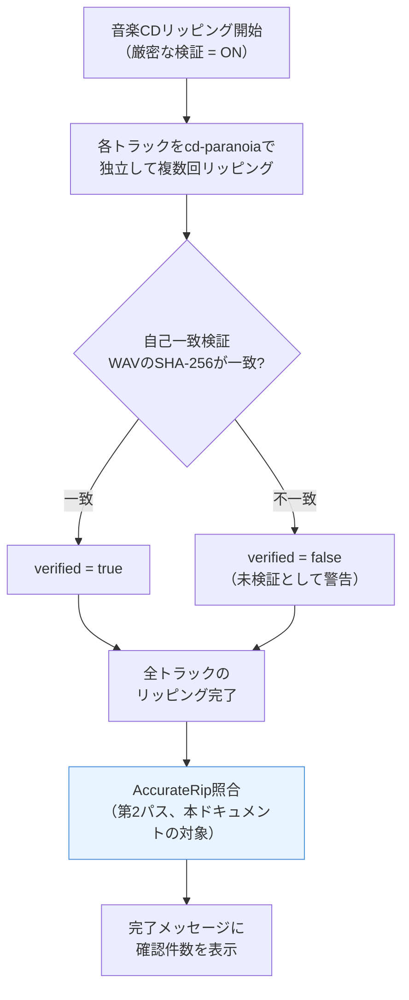
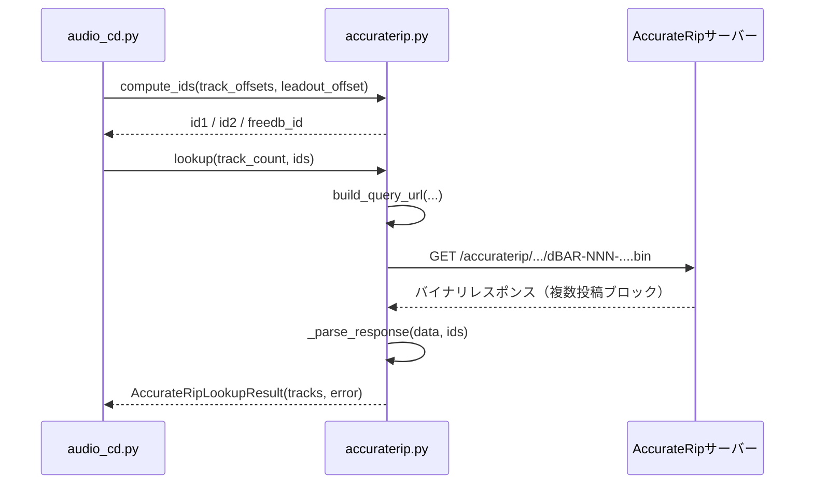
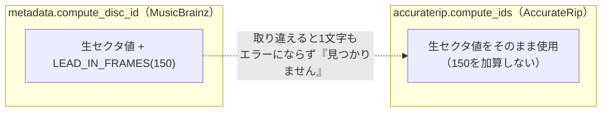
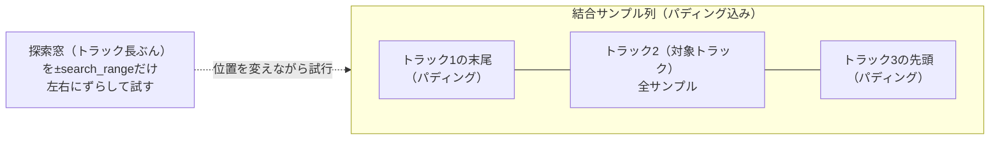
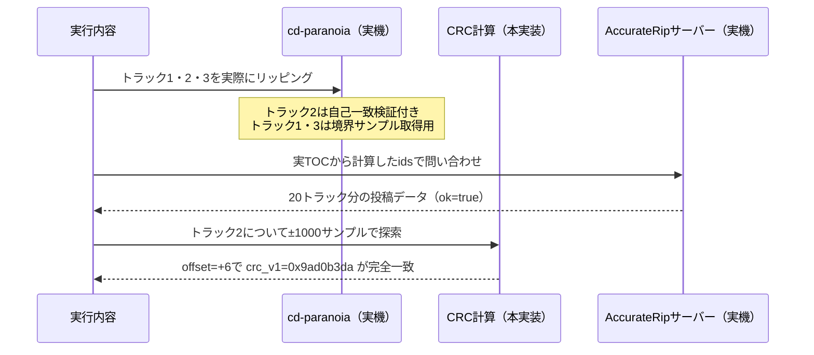
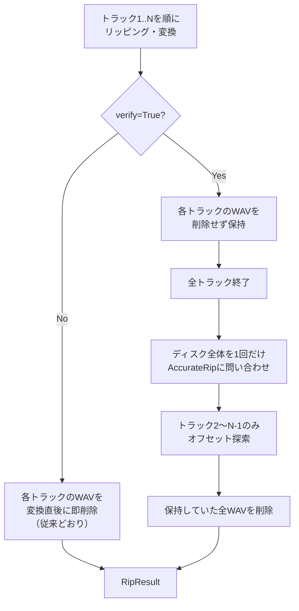
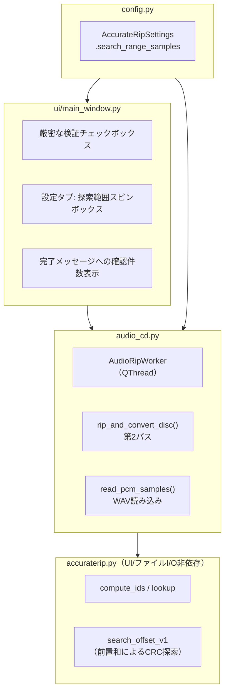

# AccurateRip照合 設計ドキュメント

このドキュメントは、[README.md](../../README.md)（利用者向けマニュアル）や
[AGENTS.md](../../AGENTS.md)（AIコーディングエージェント向けの作業方針・
回帰防止メモ）とは別に、AccurateRip照合機能の**設計判断とその根拠**を
まとめたもの。実装が変わった場合は、このドキュメントも合わせて更新する
こと（実装が先行してドキュメントが古いままにならないようにする）。

> **実装状況**: v1のみ実装済み・テスト済み（`accuraterip.py`/`audio_cd.py`/
> `config.py`/`ui/main_window.py`、`tests/test_accuraterip.py`ほか）。
> 実機（後述）での動作確認済み。v2は未実装（3.4節）。

## 1. 全体像

音楽CDのリッピング検証には2つの手段があり、両方とも「厳密な検証」
チェックボックス（`verify`）1つで有効化される。



| 手段 | 何と比較するか | 検出できること | 弱点 |
| --- | --- | --- | --- |
| 自己一致検証（既存） | 同じトラックを自分で複数回読む | cd-paranoiaの誤り訂正が機能しているか | ドライブ固有の系統的な誤りは検出できない |
| **AccurateRip照合（本機能）** | 他の利用者が投稿したCRC | ドライブ固有の誤りも含め、他者の結果との一致 | ディスクが未登録だと検証不可 |

既存の「厳密な検証」チェックボックスの延長として扱い、MusicBrainzの
「オンラインで検索」ボタンのような独立操作にはしない。理由:
実際のリッピングツール（EAC/XLD/whipper等）でも、AccurateRip照合は
「正確な検証」の一部として自動的に行われる機能であり、ユーザーが
都度手動で「検索」するものではないため。

## 2. ディスク識別子・ネットワーク通信

`src/mkhybrid_gui/accuraterip.py`が担当する（実サーバーで動作確認済み）。



| 関数 | 役割 | 備考 |
| --- | --- | --- |
| `compute_ids` | TOCからid1/id2/freedb_idを計算 | **`LEAD_IN_FRAMES`(150)を加算しない**（後述） |
| `build_query_url` | 問い合わせURLを組み立て | ファイル名の末尾3〜1文字目をディレクトリ階層に使う独自規約 |
| `lookup` / `_parse_response` | 問い合わせ・バイナリパース | 例外を投げず、エラー・0件もベストエフォートで返す（`musicbrainz.py`と同じ設計） |

### オフセット規約の違い（最重要・取り違え注意）



`tests/test_accuraterip.py`の
`test_compute_ids_does_not_add_lead_in_frames`で、この2つの規約を
混同する回帰を機械的に検出する。

## 3. CRC計算・オフセット探索

### 3.1 なぜオフセット探索が必要か

AccurateRipのCRC計算は、リッピングした生PCMサンプルに対して**ドライブ
固有の読み取りオフセット補正**を前提にしている。オフセット無しで計算した
チェックサムは、完璧に正確なリッピングでもデータベースと一致しない。
そのため「オフセットを一定範囲で総当たり探索し、一致するものを採用する」
実装が必須。



窓が正しい位置（実際のドライブオフセットと一致する位置）にぴったり
はまったときだけ、計算したCRCが投稿済みの値と一致する。

### 3.2 CRC v1の式（実データで検証済み）

トラックの位置`k`（0始まり、ウィンドウ内の**ローカル**位置）にある
サンプル`sample_k`に対し、

```
v1 = (Σ sample_k * (k+1)) & 0xFFFFFFFF   （k = 0 .. track_length-1）
```

各サンプルは、左右チャンネル（16bit符号あり）を符号なしに変換した上で
結合した32bit値: `sample = (right_unsigned << 16) | left_unsigned`。

> **重要**: 乗数`(k+1)`は、探索しているオフセット仮説（窓の開始位置）
> には依存しない、あくまで窓の中でのローカル位置。下表のとおり、
> 実装の初期段階でここを取り違えるバグがあった。

### 3.3 実機での検証結果

| 項目 | 内容 |
| --- | --- |
| 実施時期 | このセッション中（2026年9月） |
| 使用ディスク | 実際の音楽CD「Satie: Pièces Pour...」 |
| トラック数 / サイズ | 20トラック / 約564MB |
| ドライブ | ASUS SDRW-08U9M-U（USB接続） |
| 検証対象トラック | トラック2（前後にトラック1・3が存在する中間トラック） |
| 見つかったオフセット | **+6サンプル** |
| 一致した投稿 | confidence=10、`crc_v1=0x9ad0b3da` |
| 結果 | **完全一致を確認** |

手順:



この結果により、v1の計算式・オフセット探索の考え方そのものが
正しいことが実データで裏付けられた。

### 3.4 v2は未実装（意図的に見送り）

CRC v2（AccurateRipの補充チェックサム）について、以下の2種類の式を
実データ（同じトラック2、同じオフセット+6、期待値`crc_v2=0xca31ba72`）
で試したが、いずれも一致しなかった。

| 試した式 | 計算結果 | 判定 | 備考 |
| --- | --- | --- | --- |
| per-term fold（各項ごとに`(積>>32)+(積&0xFFFFFFFF)`を加算） | `0x3911f731` | 不一致 | この値が**同じディスクの別投稿のcrc_v1**と偶然でなく完全一致し、式の誤りが明確に示された |
| 末尾一括fold（合計してから最後に1回畳み込む） | `0x3948a687` | 不一致 | — |

正確な式を特定できないまま実装すると、無音で「不一致」を量産する
（＝実際には正確にリッピングできているのに「未検証」と誤報告し続ける）
リスクがあるため、**v1のみを実装し、v2は将来の課題として保留する**
（ユーザーとの合意事項）。

### 3.5 実装（前置和によるO(1)/オフセット高速化）

| 版 | 計算量 | 716万サンプルのトラックで2001通りのオフセットを試した場合 | 結果 |
| --- | --- | --- | --- |
| 初期実装（素朴なループ） | O(オフセット数 × トラック長) | 完了の見込みが立たず、途中で強制終了 | 不採用 |
| **前置和版（採用）** | 前処理O(N) + O(1)/オフセット | 数秒で完了 | 採用・実装済み |

`combined`をパディング込みの結合サンプル列とし、

```
P[n]  = Σ combined[i]        (i = 0 .. n-1)   … 単純な前置和
WP[n] = Σ combined[i] * i     (i = 0 .. n-1)   … 絶対位置で重み付けした前置和
```

を1回だけ構築（O(N)）しておけば、任意のオフセット仮説（窓の開始位置
`start`、長さ`length`）に対して、

```
C(start)  = P[start+length]  - P[start]
T(start)  = (WP[start+length] - WP[start]) - start * C(start)
v1(start) = (T(start) + C(start)) & 0xFFFFFFFF
```

でO(1)に計算できる（`T(start)`は「ウィンドウ内ローカル位置`k`で重み付けした
合計」を、絶対位置ベースの前置和から導出したもの）。ランダムデータでの
素朴なO(L)版との一致をテストで確認済み
（`tests/test_accuraterip.py::test_fast_v1_matches_brute_force_reference_on_random_data`）。

実装は`accuraterip.py`の`_build_prefix_sums`/`_fast_v1`/`search_offset_v1`。

## 4. リッピングパイプラインへの統合

### 4.1 設計判断: 「全トラックリッピング後の第2パス」方式

トラック単位のオフセット探索には、対象トラックの前後にある程度の
隣接トラックのサンプル（探索範囲ぶん以上）が必要になる。

| 案 | 概要 | メモリ/ディスク | 既存コードへの影響 | 採否 |
| --- | --- | --- | --- | --- |
| A: 1トラック遅延パイプライン | 前トラックの末尾を保持しつつ、次トラックが揃った時点で前トラックを確定する | 省メモリ・省ディスク | 既存のトラック単位ループの制御フローを大きく変更、リスク高 | 不採用 |
| **B: 全トラック後の第2パス** | `verify=True`時、変換後もWAVを即座に削除せず保持。全トラック終了後にまとめて照合し、最後に一括削除 | 最大でCD1枚ぶん（数百MB）が一時的に残る | `finally`の削除タイミングを条件分岐するだけ | **採用** |

案Bを採用した理由: 既存のループへの変更が最小限で、AccurateRip関連の
ロジックを独立した後処理として切り出せるためテストしやすく、バグを
混入させるリスクが低い。一時ディスク使用量の増加は、既存のISO作成機能も
同程度のサイズを扱っており許容範囲と判断した。



### 4.2 先頭・最終トラックの扱い

AccurateRipの一般的な実装では、ディスクの最初/最後のトラックについて
「先頭/末尾の数千サンプルをCRC計算から除外する」という特別なトリミング
規則があるとされる。今回の実機検証はディスク中間のトラック（トラック2）
でのみ行っており、この特別なトリミング規則自体は実データで確認できて
**いない**。

未確認の式を本番コードに持ち込むと「無音で不一致になり続ける」リスクが
あるため、**トラック1と最終トラックはAccurateRip照合の対象外**とする
（`accuraterip_confidence`は常に`None`のまま＝「不一致」ではなく
「未実施」として区別する）。中間トラック（2番目〜最後から2番目）のみ
照合を行う。


## 5. モジュール境界



| モジュール | 役割 |
| --- | --- |
| `accuraterip.py` | UIフレームワーク・ファイルI/Oに依存しない、純粋なID計算・CRC計算・ネットワーク通信 |
| `audio_cd.py` | WAVファイルの読み書き（`read_pcm_samples`）、リッピングループへの統合（`rip_and_convert_disc`の第2パス） |
| `config.py` | `AccurateRipSettings.search_range_samples`（既定1000、実機検証で使用した値） |
| `ui/main_window.py` | チェックボックスのラベル更新、設定タブのスピンボックス、完了メッセージ |

## 6. UI要素

> このドキュメント作成時点では、リポジトリのサンドボックス環境から
> 実際のGUIウィンドウのスクリーンショットを撮影する手段がなかった
> （PySide6アプリはネイティブmacOSウィンドウのため、ブラウザ経由の
> キャプチャ手段が使えず、AppleScript/System Eventsによる自動操作も
> このセッションでは権限の都合で動作しなかった）。以下はテキストによる
> モックアップであり、実際のキャプチャ画像ではない。

```
┌───────────────────────────────────────────────────────────┐
│ ☑ 厳密な検証（複数回読み取り比較 + AccurateRip照合。         │
│   ディスクの識別情報をAccurateRip.comへ送信します。時間は約2倍）│
└───────────────────────────────────────────────────────────┘

「設定」タブ:
┌───────────────────────────────────────────────────────────┐
│ AccurateRipのオフセット探索範囲（±）:  [ 1000 サンプル ▲▼ ]  │
└───────────────────────────────────────────────────────────┘

完了ダイアログ（例）:
┌───────────────────────────────────────────────────────────┐
│ 20曲を書き出しました。（保存先: /Volumes/.../Satie）          │
│ （AccurateRipで15/20曲が確認されました）                     │
└───────────────────────────────────────────────────────────┘
```

## 7. 既知の制限

| 項目 | 内容 |
| --- | --- |
| v2未対応 | 正確な式を特定できず未実装（3.4節）。将来、正しい式が判明した場合に追加する |
| 先頭・最終トラック対象外 | 端点トリミング規則が実データで未確認のため（4.2節） |
| ディスク未登録時 | エラーではなく「確認できないトラック」として扱う（`accuraterip_confidence = None`） |
| 探索範囲を超えるオフセット | 既定±1000サンプルを超える極端なオフセットのドライブでは、正確にリッピングできていても一致が見つからないことがある。設定タブから範囲を広げられる |
| 同一モデルの複数ドライブ | 本機能自体には該当しないが、関連する`cdrdao.py`の`find_scsi_device`には同様の制限がある（[docs/design/](.)配下に個別ドキュメントがあれば参照） |
