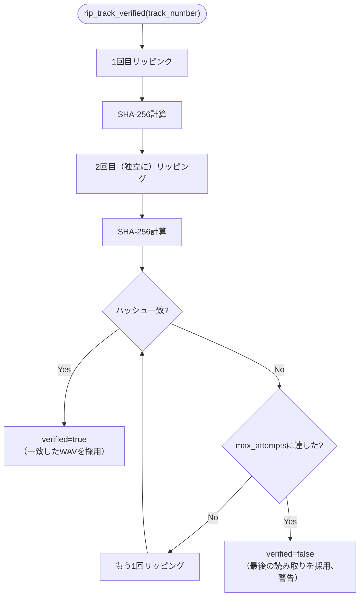
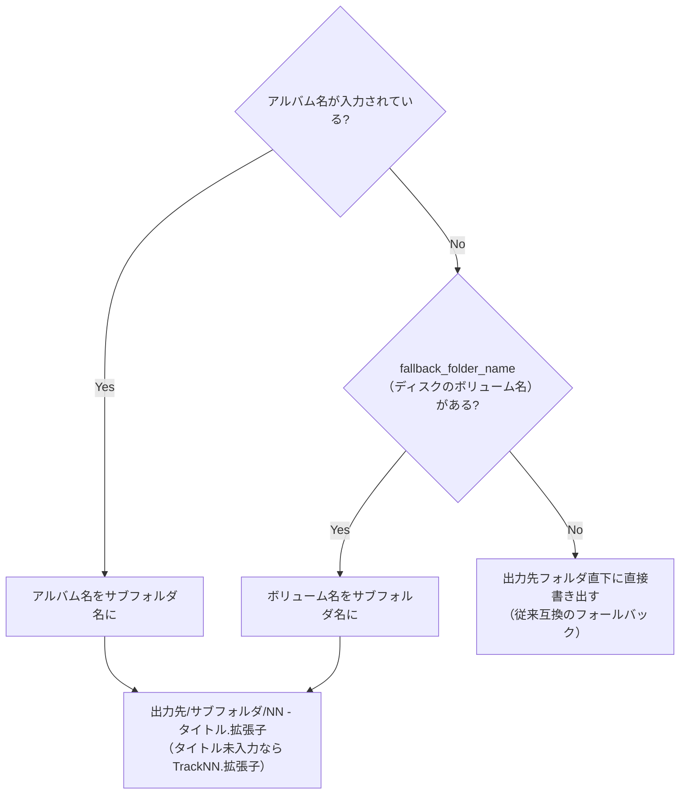
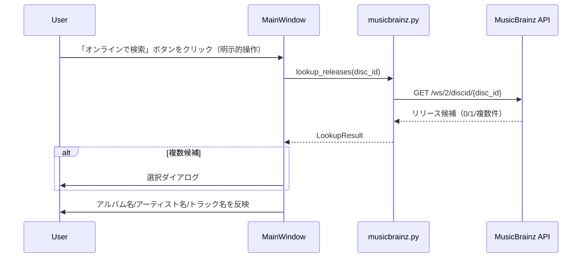
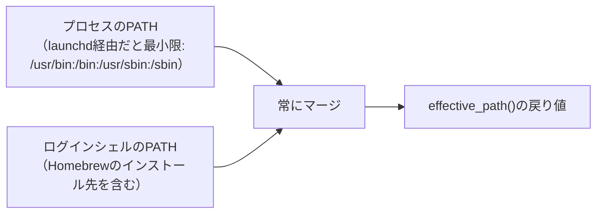

# 音楽CDの正確なリッピング 設計ドキュメント

対象モジュール: [audio_cd.py](../../src/mkhybrid_gui/audio_cd.py)、
[metadata.py](../../src/mkhybrid_gui/metadata.py)、
[musicbrainz.py](../../src/mkhybrid_gui/musicbrainz.py)。
全体像は[docs/design/README.md](README.md)を参照。AccurateRip照合は
別ドキュメント（[accuraterip.md](accuraterip.md)）。

## 1. 目的・要件

macOS標準のCDDAFSマウント（Finderが見せる再生可能なAIFFファイル）は、
ドライブの誤り訂正結果を検証する手段が無いため使わない。代わりに
EAC/XLD相当の精度を得るため、以下3つの要件を満たす。

| 要件 | 実装 |
| --- | --- |
| 正確な読み取り | `cd-paranoia`を**パラノイアモード**（既定、`-Z`を渡さない）で実行 |
| 誤り訂正・再読込 | cd-paranoia自体が内部で行う（再実装しない） |
| 検証 | 1トラックを独立して複数回（既定2回、不一致なら最大`max_attempts`回）リッピングし、WAVのSHA-256が一致するか確認 |

> **やってはいけないこと**: `cd-paranoia`に`-Z`（パラノイア無効化）を
> 指定しない。誤り訂正・再読込を無効化してしまい要件を満たせなくなる。

## 2. トラック単位の検証フロー

`verify=False`の場合は1回だけ読み取り、cd-paranoia自身の誤り訂正・
再読込のみに頼る（検証は行わない）。

## 3. 出力ディレクトリ・ファイル名

> **実機で発見された回帰**: `rip_and_convert_disc()`を、アルバム名未入力時に
> 出力先フォルダ直下へ直接書き出す実装に戻さない。アルバム名・
> `fallback_folder_name`のいずれも指定されない場合に限り、従来通り
> 出力先フォルダ直下に書き出してよい。`MainWindow._start_audio_rip()`は
> `Volume.volume_name`（無ければ`device_identifier`）を
> `fallback_folder_name`として必ず渡すこと。これを怠ると、アルバム名を
> 入力し忘れた場合に複数回のリッピング結果が出力先フォルダ直下で
> 無秩序に混在する（実機での報告により発見）。

## 4. メタデータ・MusicBrainz連携

| 項目 | 内容 |
| --- | --- |
| Disc ID計算 | `metadata.compute_disc_id`（オフセットは生LBAに`LEAD_IN_FRAMES`(150)を加算、SHA-1 + Base64の`+/=`を`._-`に置換）。実際にMusicBrainz APIへ問い合わせて確認した実データをテストベクタに使用 |
| タグ書き込み | `mutagen`。MP4(ALAC/AAC)はiTunes系アトム、FLACはVorbis Comment、WAV/AIFFはID3v2。全項目未入力ならスキップ |
| 通信の発生タイミング | 「オンラインで検索」ボタンの明示的クリックのみ。デバイス選択時やアプリ起動時に暗黙で通信を発生させない |
| レート制限 | 1秒1リクエスト（`musicbrainz._wait_for_rate_limit`）。IPブロックのリスクがあるため無視しない |

## 5. 外部コマンドのPATH解決

> **実機で発見された回帰**: GUIアプリとして（Finder等から）起動された
> 場合でも、macOS/launchdはプロセスに最小限のPATHを設定するため、
> 「PATHが空の場合だけログインシェルを問い合わせる」という条件分岐では
> 常にHomebrewのコマンドが見つからなくなる。`effective_path()`は
> PATHの空/非空にかかわらず**常に**ログインシェルのPATHを取得して
> マージする。この関数は先頭アンダースコアを付けない公開関数であり、
> `cdrdao.py`など他のモジュールからも再利用する（同じロジックを複数箇所に
> 実装しない）。

## 6. cd-paranoiaの診断メッセージ

`cd-paranoia`の出力に含まれる`"Option not supported by drive"`は、
ドライブが一部の拡張コマンドに対応していないという診断メッセージで、
リッピング自体には影響しない。ログにはそのまま表示しつつ、初回出現時に
のみ「エラーではない」旨の補足を1行添える（実機での報告により、
説明なしではエラーだと誤解されやすいことが判明したため）。

## 7. 安全な中断

`AudioRipWorker.request_cancel()`が実行中の外部コマンドへ`terminate`を
送るほか、作成途中の一時ファイル（WAV・部分的な変換済みファイル）を
削除する（`audio_cd.RipCancelled`）。

## 8. 既知の制限

| 項目 | 内容 |
| --- | --- |
| コピーガード付きメディア | セクタ単位の特殊な読み取りが必要なディスクには対応していない。追加オプションの[cdrdao](cdrdao-disk-image.md)をフォールバックとして選べるが、全方式への対応を保証するものではない |
| MusicBrainz複数候補 | 簡易的な一覧選択（`QInputDialog`）のみ。候補ごとのトラックリストのプレビュー等は今後の拡張候補 |
