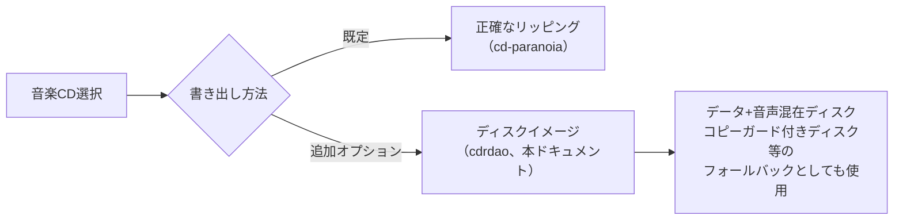
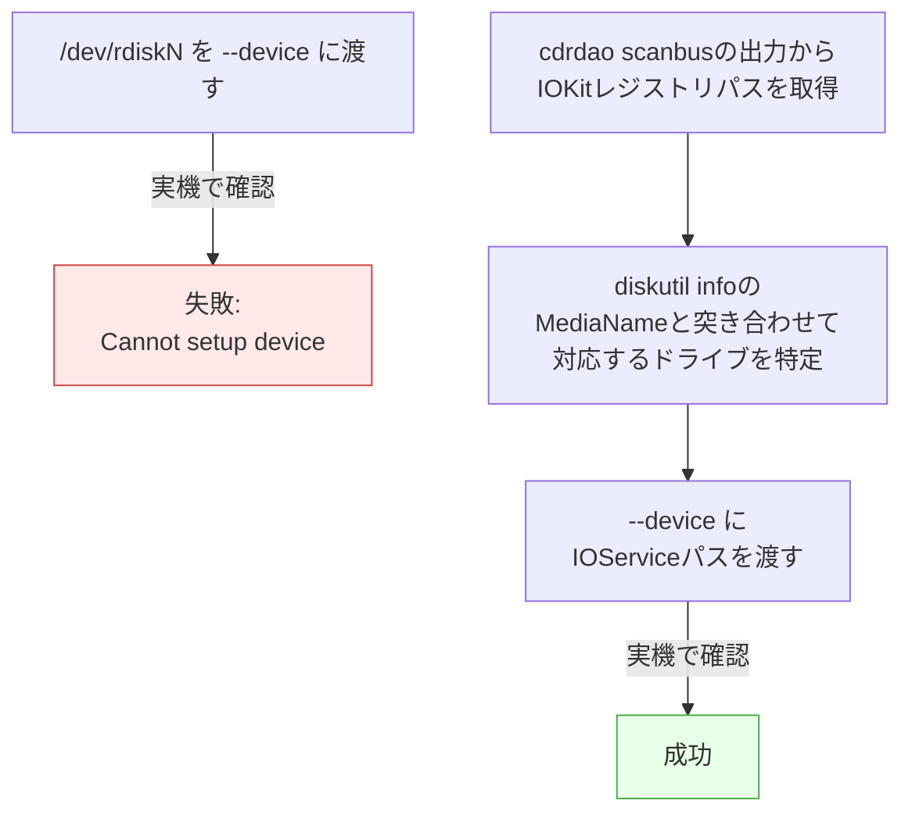
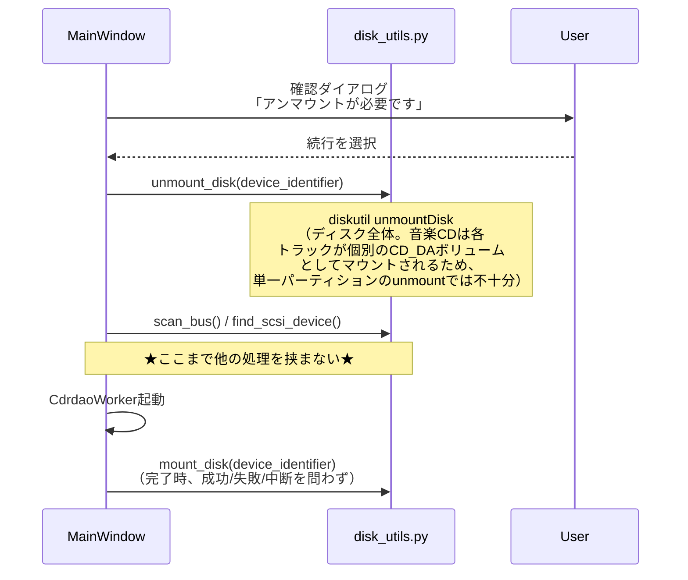
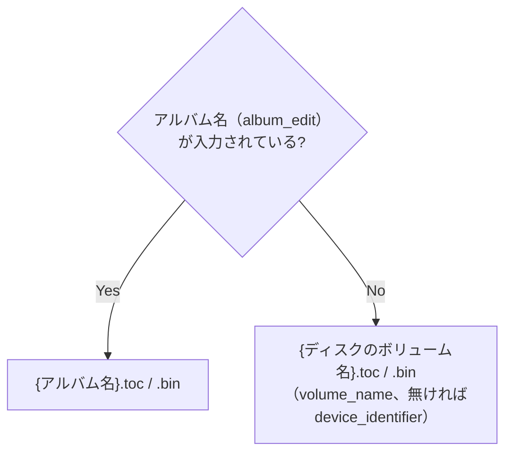

# cdrdaoによるディスクイメージバックアップ 設計ドキュメント

対象モジュール: [cdrdao.py](../../src/mkhybrid_gui/cdrdao.py)、
[disk_utils.py](../../src/mkhybrid_gui/disk_utils.py)（アンマウント/
再マウント・デバイス情報取得部分）。全体像は
[docs/design/README.md](README.md)を参照。

## 1. 目的・位置づけ

既存の[正確なリッピング](audio-accurate-ripping.md)（トラックごとの
変換・タグ付け）を**置き換えるものではなく**、音楽CD選択時にGUI上で
選べる追加の書き出し方法。ディスク全体を`cdrdao read-cd`でTOC（`.toc`）
+BIN（`.bin`）のイメージとしてビット単位でバックアップする。



## 2. デバイス指定（実機で確認・修正済み）

macOSの`cdrdao`は、他の外部コマンド（`cd-paranoia`/`hdiutil`）と異なり
`/dev/rdiskN`を受け付けない。`cdrdao scanbus`が返す**IOKitレジストリ
パス**を`--device`に渡す必要がある。



`cdrdao scanbus`の実際の出力例（実機、ASUS SDRW-08U9M-U、USB接続）:

```
IOService:/AppleARMPE/.../IODVDServices : ASUS, SDRW-08U9M-U, A114
```

`vendor, model, rev`の`vendor + " " + model`部分を、`diskutil info`の
`MediaName`（例:`"ASUS SDRW-08U9M-U"`）と照合してIOKitパスを特定する
（`cdrdao.find_scsi_device`）。同一モデルのドライブが複数接続されている
場合は区別できない（既知の制限）。

## 3. 排他アクセスのためのアンマウント（実機で確認・修正済み）

`cd-paranoia`はマウントされたままでも動作するが、`cdrdao`は
ファイルシステム層を経由せずSCSI/MMCコマンドで直接ドライブへアクセス
するため、macOSがボリュームを1つでもマウントしたままだと排他アクセスに
失敗する。



> **実機で発見された重要な回帰リスク**: アンマウントしてから`cdrdao`が
> 実際にドライブへアクセスするまでに間が空くと、**macOSが自動的に
> 再マウントしてしまい**`cdrdao`が`"Device already in use"`で失敗する
> （実機で再現・確認済み）。`MainWindow._start_cdrdao_rip()`は、確認
> ダイアログの直後、`unmount_disk()`→`scan_bus()`/`find_scsi_device()`→
> ワーカー起動までを他の処理を挟まず連続して行うこと。

## 4. コマンド構築

```
cdrdao read-cd --device <IOKitパス> --driver generic-mmc-raw \
    --paranoia-mode 3 --datafile <bin> <toc>
```

| オプション | 意味 |
| --- | --- |
| `--driver generic-mmc-raw` | 汎用SCSI-3/MMCドライバ（実機で動作確認済み） |
| `--paranoia-mode 3` | フルパラノイア（ジッター補正+誤り訂正+再読込を最大限有効化）。**省略・弱いモードへの変更をしないこと**（`cd-paranoia`に`-Z`を渡さない既定動作と同じ位置づけの要件） |

## 5. 出力ファイル名

正確なリッピングの`fallback_folder_name`と同じ考え方だが、cdrdaoは
1回の実行につき1組のファイルのみのため、**サブフォルダは作らず**出力先
フォルダ直下に直接書き出す。



同名の`.toc`/`.bin`が既に存在する場合は上書き確認ダイアログを出す。

## 6. 進捗表示（実機で確認済み）

`cdrdao`はトラック一覧やサブチャンネル読み取り状況等のログは出力するが、
機械可読な進捗率（パーセント）は出力しない。そのため`CdrdaoWorker`は
`progress_percent`相当のシグナルを持たず、進捗バーは`hdiutil makehybrid`
と同様に不確定（ビジー）表示のままにする。

## 7. 実機での動作確認

| 項目 | 内容 |
| --- | --- |
| ドライブ | ASUS SDRW-08U9M-U（USB接続） |
| ディスク | 20トラック / 約564MB / 約53分の音楽CD |
| 実行結果 | フルパラノイアモードでの読み取り全体が成功 |
| 所要時間 | 約13分 |
| 検証 | 生成された`.bin`のサイズが、diskutilの報告するディスクの実サイズ（563,579,184バイト）と完全一致 |

## 8. 既知の制限

| 項目 | 内容 |
| --- | --- |
| **同一モデルの複数ドライブ（対応しない・クローズ済み）** | `find_scsi_device`はモデル名（`diskutil`の`MediaName`と`cdrdao scanbus`の`vendor, model`）でしか区別できないため、同一モデルの光学ドライブが複数接続されている場合は最初に一致したものを使う。この開発環境には検証可能な光学ドライブが1台（ASUS SDRW-08U9M-U）しか無く、複数ドライブでの実機検証ができないため、これ以上の実装（下記「将来の対応案」）は行わない |
| PATH解決の重複防止 | `cdrdao.py`は`audio_cd.effective_path()`/`tool_path()`/`command_env()`を再利用し、同じPATH解決ロジックを再実装しない（過去に回帰した実績のある箇所を2箇所に増やさないため） |
| トラック分割 | 生成したBINをトラックごとのファイルに分割する機能は無い（TOC+BINイメージをそのまま保存するのみ） |

### 同一モデル複数ドライブ問題への将来の対応案（未着手・参考）

もし将来、複数台の同一モデルドライブで実機検証できる機会があれば、
以下のような追加の突き合わせ方法が考えられる（いずれも未検証）。

- `diskutil info -plist`の`DeviceTreePath`（例:
  `IODeviceTree:/arm-io@.../usb-drd3@.../usb-drd3-port-hs@...`）と、
  `cdrdao scanbus`が返すIOKitレジストリパスの前方一致で絞り込む
  （`DeviceTreePath`は`IOService:`パスの一部分に相当する可能性が高いが、
  実機で未確認）。
- USBのロケーションID（`system_profiler SPUSBDataType`等）で
  ポートごとに一意な識別子を取得し、どちらの経路からも参照できる形に
  変換する。

いずれも実データでの検証が無いまま実装すると、誤った組み合わせで
別のドライブを操作してしまうリスクがあるため、実機検証ができるまでは
着手しない。
