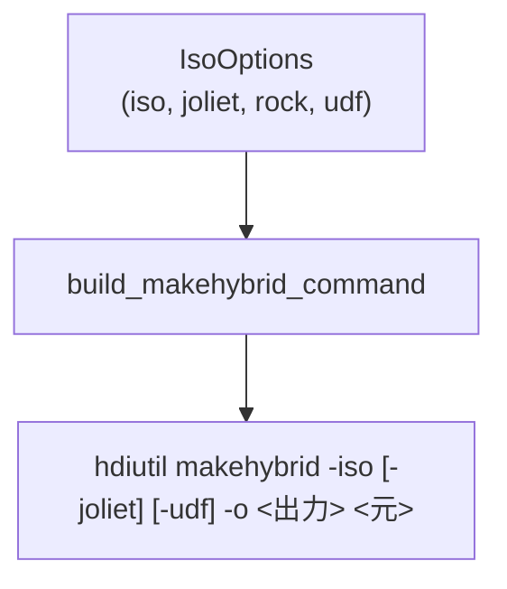
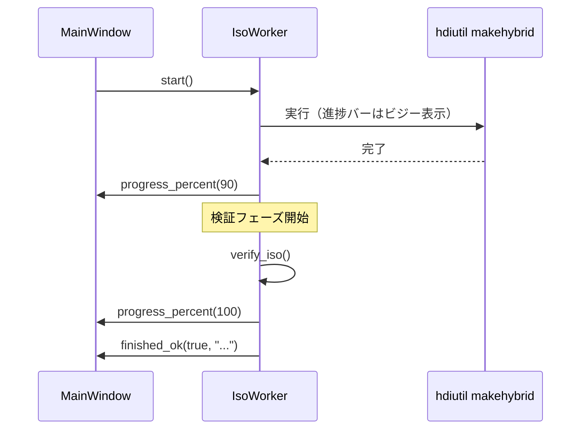
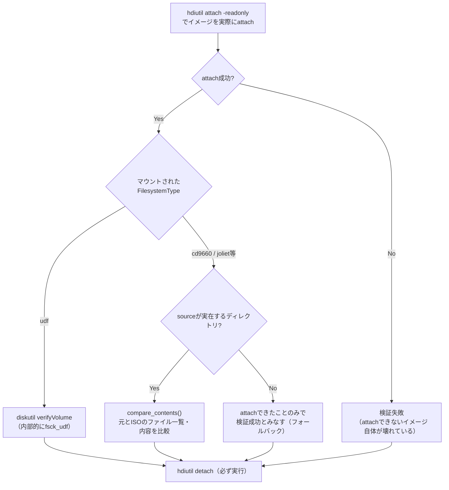

# ISO作成（データCD/DVD/Blu-ray）設計ドキュメント

対象モジュール: [iso_builder.py](../../src/mkhybrid_gui/iso_builder.py)。
全体像は[docs/design/README.md](README.md)を参照。

## 1. 目的

macOSに接続したデータCD/DVD/Blu-ray（BDXL・M-DISCを含む）の内容を、
`hdiutil makehybrid`でWindows/Linux双方で読み取り可能なハイブリッド
ISOイメージ（ISO 9660 + Joliet + Rock Ridge + 任意でUDF）に変換する。

## 2. コマンド構築

| オプション | GUI上のチェックボックス | 実際にコマンドへ渡るか | 備考 |
| --- | --- | --- | --- |
| `-iso` | （常時有効） | 渡る | ISO9660の基本フォーマット |
| `-joliet` | Joliet | 渡る | Windows向け長いファイル名対応 |
| `-udf` | UDF | 渡る | DVD/BD等の大容量ファイル対応（4GB超） |
| `-rock` | Rock Ridge | **渡らない** | `hdiutil makehybrid`自体が受け付けない。`-iso`指定時に自動的に有効になる |

> **実機で確認済み**: `-rock`・`-puppetstrings`オプションは`hdiutil
> makehybrid`に一切渡せない（指定すると`-puppetstrings option not
> allowed`等で失敗する）。そのためGUI上の「Rock Ridge」チェックボックスは
> 実際のコマンドに一切影響しない。「Joliet/UDFのいずれかを有効に」という
> オプション検証にも`rock`を含めない（Rock Ridgeだけ有効な状態と全項目
> 無効な状態が同一コマンドになり、後者だけエラーになる一貫性のない挙動を
> 防ぐため。実機での報告により発見・修正済み）。

## 3. 進捗表示

> **実機で確認済み**: `-verbose`を付けても、`hdiutil makehybrid`は
> ビルド中に機械可読な進捗率（パーセント）を一切出力しない。そのため
> `IsoWorker`の進捗バーは、ISO作成フェーズでは常に不確定（ビジー）表示に
> フォールバックする。検証フェーズの開始時点で90%、完了時点で100%へ
> 切り替える（下図）。

## 4. 検証（なぜ`hdiutil verify`を使わないか）

| 検証方式 | 使うタイミング | 検出できること |
| --- | --- | --- |
| ~~`hdiutil verify`~~（不採用） | — | **使わない**。`hdiutil makehybrid`が生成するイメージにはチェックサムが一切含まれない（`hdiutil imageinfo`で`Checksummed: false`を実機確認済み）ため、正常なISOイメージに対しても必ず`"has no checksum"`で失敗する |
| `diskutil verifyVolume` | マウントしたファイルシステムが`udf`の場合のみ | ファイルシステムの整合性（`fsck_udf`）。意図的にtruncateした壊れたイメージで`Bad extent in file`/`Filesystem is dirty`を正しく検出できることを実機確認済み |
| `compare_contents`（サイズ+SHA-256） | UDFを含まない（ISO9660/Jolietのみ、CD選択時の既定）イメージで、作成元が参照できる場合 | 切り詰め・欠損・同一サイズのまま内容だけ壊れているケース。`diskutil verifyVolume`はこのケースで常に`"Invalid request (-69886)"`となり使えない（実機確認済み） |
| attachのみ（フォールバック） | 作成元が既に参照できない場合 | attachできること（内容の詳細検証はできない、既知の制限） |

> **実機で発見された回帰**: `IsoWorker.run()`から`verify_iso()`への
> `source=self._source`の受け渡しを削除すると、UDFを含まないイメージの
> 検証が「attachできたことのみ確認」まで後退し、切り詰め・内容破損が
> あっても検出できなくなる。

検証中の出力は、完了を待たずその場でGUIへストリーミング表示する
（`subprocess.run`で完了まで待ってからまとめて表示する実装には戻さない。
検証中の進捗表示が完了までフリーズしたように見える回帰になる）。

## 5. 安全な中断

`IsoWorker.request_cancel()`が実行中の`hdiutil`プロセスへ`terminate`
（SIGTERM）を送る。処理中はウィンドウを閉じられないようにし
（`MainWindow.closeEvent`）、バックグラウンドスレッドを残したままアプリが
終了しないようにする。

## 6. 既知の制限

| 項目 | 内容 |
| --- | --- |
| 進捗の粒度 | `hdiutil makehybrid`自体が進捗率を提供しないため、ファイル単位・バイト単位の詳細な進捗表示は実現できていない |
| コピーガード付きメディア | セクタ単位の特殊な読み取りが必要なディスクには対応していない（エラーメッセージで案内するのみ） |
| 複数ドライブの並行処理 | 対応していない（1台ずつの逐次処理） |
